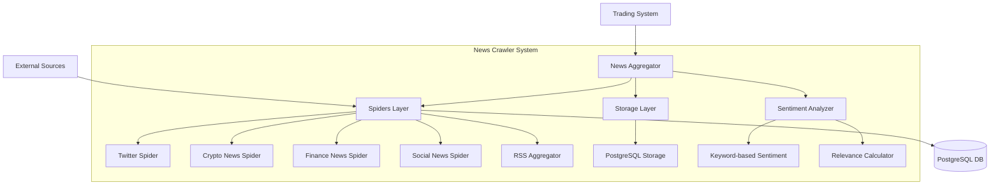

# News Crawler Technical Design Specification

Feature Name: news-crawler
Updated: 2026-03-26

## Description

新闻爬虫系统是一个模块化的新闻获取、存储和分析平台，支持从 Twitter/X、加密货币新闻、金融新闻、社群平台和 RSS 订阅源获取新闻数据，并存储到 PostgreSQL 数据库进行持久化。

## Architecture



## System Structure

```
news/
├── __init__.py
├── news_aggregator.py        # 主聚合器（扩展现有）
├── spiders/
│   ├── __init__.py
│   ├── base_spider.py        # 爬虫基类
│   ├── twitter_spider.py     # Twitter/X 爬虫
│   ├── crypto_news.py        # 加密货币新闻爬虫
│   ├── finance_news.py       # 金融新闻爬虫
│   ├── social_news.py        # 社群新闻爬虫
│   └── rss_aggregator.py     # RSS 聚合器
├── storage/
│   ├── __init__.py
│   └── postgres_storage.py   # PostgreSQL 存储
├── config/
│   └── news_config.json      # 配置文件
└── models.py                 # 数据模型
```

## Components and Interfaces

### 1. BaseSpider

所有爬虫的基类，提供通用功能：

```python
class BaseSpider(ABC):
    def __init__(self, config: Dict): ...
    def _check_rate_limit(self) -> bool: ...
    def _record_request(self) -> None: ...
    @abstractmethod
    def fetch_news(self, keywords: List[str], limit: int) -> List[NewsItem]: ...
```

### 2. TwitterSpider

Twitter/X 爬虫，支持 Nitter 实例和 Twitter API：

- **Nitter 实例列表**: 可配置的公共 Nitter 实例
- **关键词搜索**: 支持 `$BTC`, `$ETH` 等搜索语法
- **自动降级**: Nitter 不可用时切换到 Twitter API

### 3. CryptoNewsSpider

加密货币新闻爬虫：

| 新闻源 | 优先级 | URL |
|--------|--------|-----|
| CoinDesk | 1 | https://coindesk.com/arc/outboundfeeds/rss/ |
| Cointelegraph | 2 | https://cointelegraph.com/rss |
| CryptoSlate | 3 | https://cryptoslate.com/feed/ |
| The Block | 4 | https://www.theblock.co/rss |

### 4. FinanceNewsSpider

金融新闻爬虫：

| 新闻源 | 优先级 | URL |
|--------|--------|-----|
| Yahoo Finance | 1 | https://finance.yahoo.com/news/rssindex |
| Reuters | 2 | https://www.reutersagency.com/feed/ |
| Bloomberg | 3 | https://feeds.bloomberg.com/markets/news.rss |
| CNBC | 4 | https://www.cnbc.com/id/100003114/device/rss/rss.html |

### 5. SocialNewsSpider

社群新闻爬虫：

- Reddit: 使用 `https://www.reddit.com/r/{subreddit}/.rss`
- Telegram: 使用 `https://rsshub.app/telegram/channel/{channel}`

### 6. RSSAggregator

通用 RSS 聚合器，使用 `feedparser` 库解析 RSS。

### 7. PostgreSQLStorage

PostgreSQL 存储接口：

```python
class PostgreSQLStorage:
    def __init__(self, config: Dict): ...
    def save_news(self, news_item: NewsItem) -> bool: ...
    def save_batch(self, news_items: List[NewsItem]) -> int: ...
    def get_news(self, keywords: List[str], limit: int, 
                 since: datetime) -> List[NewsItem]: ...
    def update_sentiment(self, news_id: int, sentiment: str): ...
```

## Data Models

### NewsItem

```python
@dataclass
class NewsItem:
    title: str
    description: str
    url: str
    source: str
    source_type: str  # twitter, crypto, finance, social, rss
    author: Optional[str]
    published_at: datetime
    fetched_at: datetime
    sentiment: str = "neutral"
    relevance_score: float = 0.0
    categories: List[str] = field(default_factory=list)
```

### Database Schema

```sql
CREATE TABLE IF NOT EXISTS news_articles (
    id SERIAL PRIMARY KEY,
    title VARCHAR(500) NOT NULL,
    description TEXT,
    url VARCHAR(1000) UNIQUE NOT NULL,
    source VARCHAR(100) NOT NULL,
    source_type VARCHAR(50) NOT NULL,
    author VARCHAR(200),
    published_at TIMESTAMP,
    fetched_at TIMESTAMP DEFAULT CURRENT_TIMESTAMP,
    sentiment VARCHAR(20) DEFAULT 'neutral',
    relevance_score FLOAT DEFAULT 0.0,
    categories TEXT[],
    created_at TIMESTAMP DEFAULT CURRENT_TIMESTAMP,
    updated_at TIMESTAMP DEFAULT CURRENT_TIMESTAMP
);

CREATE INDEX idx_news_source_type ON news_articles(source_type);
CREATE INDEX idx_news_published_at ON news_articles(published_at DESC);
CREATE INDEX idx_news_sentiment ON news_articles(sentiment);
CREATE INDEX idx_news_relevance ON news_articles(relevance_score DESC);
```

## Correctness Properties

### Invariants

1. **去重**: 相同 URL 的新闻只存储一条记录
2. **时间戳**: `fetched_at` 总是系统当前时间
3. **评分范围**: `relevance_score` 必须在 0.0-1.0 之间
4. **情绪值**: `sentiment` 只能是 `positive`, `negative`, `neutral` 之一

### Constraints

1. **Rate Limiting**: 每个新闻源每秒最多 10 个请求
2. **Timeout**: HTTP 请求超时时间为 10 秒
3. **Retry**: 失败时最多重试 3 次

## Error Handling

| Error Scenario | Handling Strategy |
|--------------|-----------------|
| Nitter 实例不可用 | 自动切换到下一个实例 |
| 所有 Nitter 不可用 | 降级到 Twitter API（如果配置） |
| RSS 解析失败 | 记录错误日志，跳过该订阅源 |
| 数据库连接失败 | 记录错误日志，重试连接 |
| HTTP 请求超时 | 重试最多 3 次，间隔 1 秒 |

## Configuration Schema

```json
{
  "news": {
    "enabled": true,
    "keywords": ["bitcoin", "btc", "ethereum", "eth", "crypto", "trading"],
    "rate_limit": 10,
    "timeout": 10,
    "storage": {
      "type": "postgresql",
      "host": "localhost",
      "port": 5432,
      "database": "trading_news",
      "username": "user",
      "password": "password"
    },
    "sources": {
      "twitter": {
        "enabled": true,
        "nitter_instances": [
          "https://nitter.net",
          "https://nitter.poast.org",
          "https://nitter.fdn.fr"
        ],
        "accounts": ["CryptoCom", "binance", "coindesk"],
        "use_twitter_api": false,
        "api_key": "",
        "api_secret": ""
      },
      "crypto": {
        "enabled": true,
        "sources": ["coindesk", "cointelegraph", "cryptoslate", "theblock"]
      },
      "finance": {
        "enabled": true,
        "sources": ["yahoo", "reuters", "bloomberg", "cnbc"]
      },
      "social": {
        "enabled": true,
        "reddit": ["cryptocurrency", "Bitcoin", "ethereum"],
        "telegram": ["cryptocurrency"]
      },
      "rss": {
        "enabled": true,
        "feeds": [
          "https://feeds.feedburner.com/coindesk",
          "https://cointelegraph.com/rss"
        ]
      }
    },
    "sentiment": {
      "positive_words": ["bull", "bullish", "rise", "gain", "surge", "rally"],
      "negative_words": ["bear", "bearish", "fall", "drop", "plunge", "crash"]
    }
  }
}
```

## Test Strategy

### Unit Tests

1. **Spider Tests**: 测试各爬虫类的解析逻辑
2. **Storage Tests**: 测试数据库操作
3. **Sentiment Tests**: 测试情绪分析准确性

### Integration Tests

1. **Full Pipeline**: 测试从获取到存储的完整流程
2. **Error Recovery**: 测试各种错误场景的恢复能力

### Test Coverage

- 目标：核心模块测试覆盖率达到 80%
- 爬虫解析逻辑：100%
- 情绪分析：90%
- 存储操作：85%
